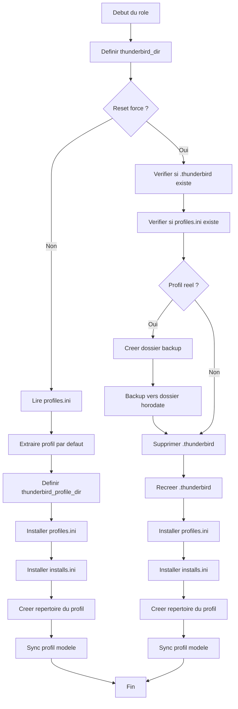

# Projet : `thunderbird-profile-deploy`

Ce projet Ansible permet d’installer, mettre à jour ou réinitialiser un profil Thunderbird à partir d’un **profil modèle** versionné dans le dépôt.  
Il fournit :

- un déploiement **idempotent**
- un **reset forcé** avec sauvegarde automatique
- une synchronisation **incrémentale** du profil modèle
- une structure claire et maintenable
- des scripts utilitaires pour exporter ou restaurer un profil

---

## ✨ Fonctionnalités principales

### ✔️ Déploiement idempotent  
En mode normal (`make deploy`), le rôle :

- détecte le profil Thunderbird existant  
- installe uniquement ce qui a changé  
- ne déclenche aucun `changed` inutile  

### ✔️ Reset forcé  
En mode reset (`make deploy thunderbird_force_reset=true`), le rôle :

- sauvegarde le profil existant (si réel)
- supprime complètement `~/.thunderbird`
- recrée un profil propre basé sur le modèle
- réinstalle `profiles.ini` et `installs.ini`

### ✔️ Sauvegarde automatique  
Avant chaque reset forcé :

- sauvegarde dans `~/.thunderbird_backup/YYYYMMDD-HHMMSS/`
- aucune sauvegarde n’est écrasée

### ✔️ Synchronisation incrémentale (rsync)  
- rapide  
- fiable  
- idempotent  

---

## 📊 Diagramme de flux du rôle



---

## 📂 Arborescence du projet

```
thunderbird-profile-deploy/
├── deploy_thunderbird.yml
├── inventory
├── Makefile
├── roles
│   └── thunderbird_profile
│       ├── defaults
│       │   └── main.yml
│       ├── files
│       │   ├── installs.ini
│       │   ├── profiles.ini
│       │   └── thunderbird_profile/
│       │       └── default-release/
│       │           └── ... (profil modèle complet)
│       ├── README.md
│       └── tasks
│           └── main.yml
└── scripts
    ├── export_thunderbird_profile.sh
    └── restore_thunderbird.sh
```

---

## 🗂️ `.gitignore` recommandé

```
# Fichiers générés par Ansible
*.retry

# Sauvegardes locales du profil Thunderbird
.thunderbird_backup/

# Profil Thunderbird réel de l'utilisateur
.thunderbird/

# Fichiers temporaires / caches
*.swp
*.swo
*~
.DS_Store

# Logs éventuels
logs/
*.log

# Environnements Python
venv/
.env/
__pycache__/

# Sauvegardes d'éditeurs
*.bak
*.tmp
```

---

## ⚙️ Variables

### `thunderbird_force_reset`
- `true` → reset complet  
- `false` → mode normal (idempotent)

---

## 🚀 Utilisation

### Mode normal

```
make deploy
```

### Reset forcé

```
make deploy thunderbird_force_reset=true
```

---

## 🔧 Script de restauration automatique

```bash
#!/usr/bin/env bash
set -e
TB_DIR="$HOME/.thunderbird"
BACKUP_DIR="$HOME/.thunderbird_backup"

echo "Recherche de la dernière sauvegarde..."
if [ ! -d "$BACKUP_DIR" ]; then echo "Aucune sauvegarde."; exit 1; fi

LAST_BACKUP=$(ls -1 "$BACKUP_DIR" | sort -r | head -n 1)
if [ -z "$LAST_BACKUP" ]; then echo "Aucune sauvegarde."; exit 1; fi

echo "Dernière sauvegarde : $LAST_BACKUP"
read -p "Restaurer ? (o/N) " confirm
[[ "$confirm" != "o" && "$confirm" != "O" ]] && exit 1

rm -rf "$TB_DIR"
cp -a "$BACKUP_DIR/$LAST_BACKUP" "$TB_DIR"
chmod -R 700 "$TB_DIR"
echo "Restauration terminée."
```

---

## 🎉 Conclusion

Le projet **thunderbird-profile-deploy** fournit :

- un déploiement propre et fiable  
- une idempotence parfaite  
- une sécurité renforcée grâce aux sauvegardes  
- une structure claire et maintenable  
- un reset forcé maîtrisé  

